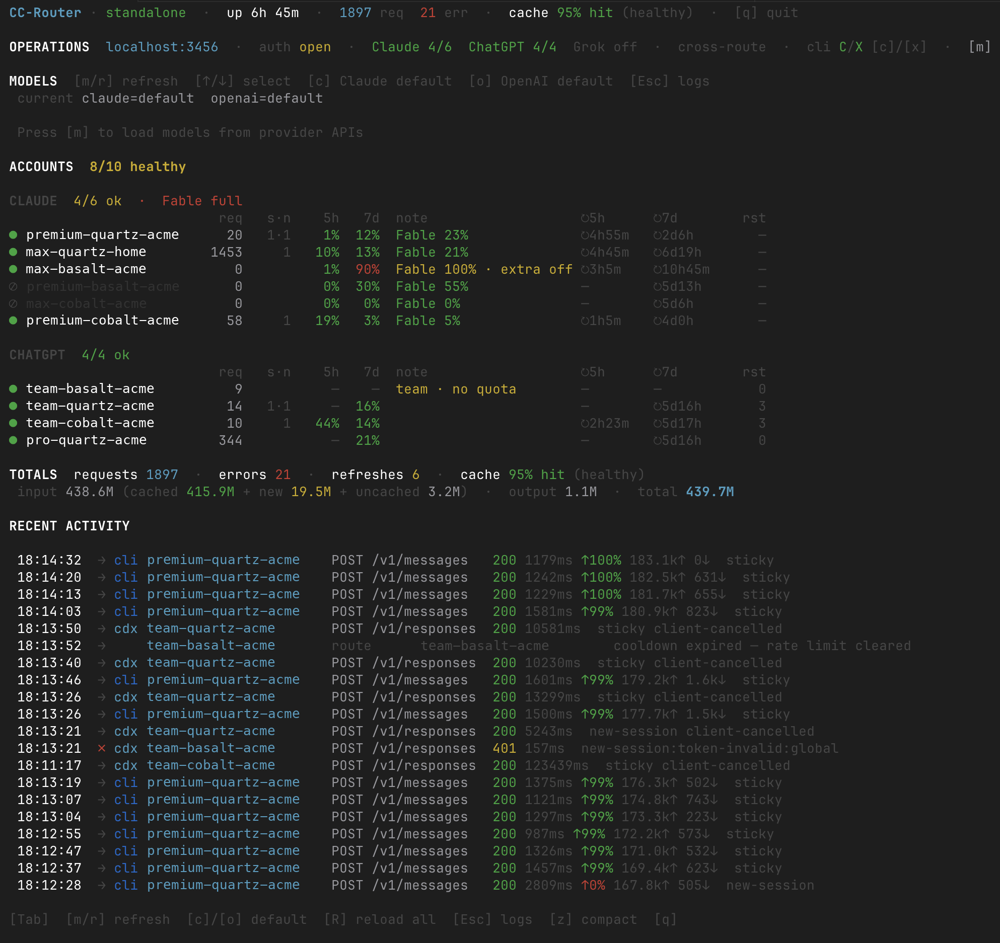

# CC-Router

**Local multi-account router for Claude Max and OpenAI ChatGPT/Codex subscriptions.**  
Distribute Claude Code requests across Claude subscriptions, and expose an OpenAI Responses-compatible route for Codex CLI through the same proxy.

[](https://www.npmjs.com/package/@timo972/cc-router)
[](LICENSE)

> **An actively maintained fork of [VictorMinemu/CC-Router](https://github.com/VictorMinemu/CC-Router)**, published as
> [`@timo972/cc-router`](https://www.npmjs.com/package/@timo972/cc-router) with bug fixes and added features — most
> notably **cache-aware sticky session routing**, which pins each Claude Code session to one account so a conversation
> keeps hitting the same prompt cache instead of scattering its shared prefix across accounts. Also includes
> load-aware account leases, byte-transparent streaming fixes, and a round of security hardening.
> See [CHANGELOG.md](CHANGELOG.md) for the full list.



### Features

- **Cache-aware session routing** — keep each Claude Code session on one account while distributing new sessions across 2-20 Claude Max accounts
- **Multi-provider routing** — route `openai/*` models to OpenAI ChatGPT/Codex subscription accounts and Claude models to Claude subscriptions
- **Transparent Claude proxy** — Claude Code works normally; streaming, thinking, tool use, prompt caching all pass through
- **Codex CLI support** — configure Codex to use CC-Router as a Responses-compatible provider
- **Automatic token refresh** — OAuth tokens are refreshed before they expire, saved atomically to disk
- **Model-aware rate limits** — avoids accounts whose requested-model or global allowance is exhausted, and respects scoped cooldowns
- **Client mode** — connect another device you own to your private CC-Router (`cc-router client connect <url>`)
- **Claude Desktop support** — route Cowork / Agent-mode traffic through CC-Router via mitmproxy interception (macOS, Windows, Linux)
- **Guided setup wizard** — interactive `cc-router setup` extracts tokens from Keychain or credentials file, configures everything
- **Live dashboard** — real-time terminal UI showing account health, request counts, token usage, recent activity
- **Proxy authentication** — Bearer / x-api-key secret; required when binding a non-loopback interface
- **Update notifications** — new releases are announced in the CLI; installing is opt-in (`autoUpdate: true`)
- **Multiple deployment modes** — background daemon, native OS auto-start (launchd/systemd), foreground, Docker Compose
- **Cross-platform** — macOS, Linux, Windows; Node.js 20+

---

> **Warning**  
> Read the [disclaimer](#disclaimer) before using this tool.

---

## How it works

```
Claude Code  (terminal)  ─┐
                          │  ANTHROPIC_BASE_URL=http://localhost:3456
                          │
Claude Desktop  ─[mitmproxy]─┐  (optional — intercepts api.anthropic.com)
                             │
                             ▼
┌─────────────────────────────────────┐
│  CC-Router  :3456                   │
│                                     │
│  1. Receives /v1/messages or        │
│     /v1/responses                   │
│  2. Parses model provider prefix    │
│  3. Picks a Claude or OpenAI account│
│  4. Refreshes token if expiring     │
│  5. Injects Authorization: Bearer   │
│  6. Forwards to Anthropic, OpenAI   │
│     Codex backend, or LiteLLM       │
└──────────────┬──────────────────────┘
               │
               ▼
        api.anthropic.com
        (authenticated with
         OAuth token of account N)
```

All standard Claude Code features work transparently on the Claude route: streaming, extended thinking, tool use, prompt caching. OpenAI subscription routing is available for Codex-compatible Responses requests and Claude Code cross-routing with the limitations documented below.

### Cache-aware Claude account routing

CC-Router keeps requests from one Claude Code session on the same eligible Anthropic subscription account. This session affinity remains account-based and preserves prompt-cache locality instead of scattering a conversation's shared prefix across account-specific caches. The model requested by each Messages call affects whether the bound account is still eligible; changing models does not create a second binding, but it can make the existing binding fail over when that account cannot serve the new model. New sessions prefer the account with the fewest in-flight requests, then the fewest bound sessions, then included allowance over paid extra usage, then the most applicable global and requested-model headroom; exact ties use a rotating round-robin order.

Anthropic cooldowns, effective global or requested-model quota exhaustion, disabled accounts, invalid authentication, and unhealthy accounts are hard exclusions. The configured per-account percentage caps are softer policy controls: when at least one account is otherwise usable but every usable account is over a configured cap, CC-Router may explicitly fall back to the least-loaded capped account. It never uses that fallback to bypass an Anthropic cooldown or exhausted effective quota.

If an upstream account returns 401, 429, or 529, CC-Router passes that response through unchanged and invalidates the session's affinity. The client's next retry can then select another usable account; the router never retries after response bytes have started. If no account is usable before forwarding begins, the router instead returns a local Anthropic-shaped 429 whenever any account is blocked by a rate limit or exhausted quota. That 429 includes `Retry-After` only when a trustworthy unblock time is known. A local 503 is reserved for entirely non-rate-limit unavailability, such as all accounts being disabled or unhealthy. Either local response makes no Anthropic Messages request. Affinity mappings exist only in process memory, expire after one hour of inactivity, and are capped in size. Session IDs are never persisted or logged.

Streaming remains byte-transparent. In particular, CC-Router never appends a synthetic `message_stop` event. `proxyRequestTimeoutMs` protects only the phase before Anthropic response headers arrive; once a response starts, its body continues through the native byte-exact proxy pipe. Automatic `cc-router configure` setup manages Claude Code's event-level and byte-level stream idle watchdogs at 30 minutes. Restart any existing Claude Code process after configuration so it inherits those values.

**Claude Desktop support** is opt-in and requires a small interceptor (mitmproxy) because Claude Desktop doesn't expose a custom API endpoint setting. See [Claude Desktop support](#claude-desktop-support).

---

## Use cases

### Heavy user — one account isn't enough

Claude Max has rate limits per account. If you hit them regularly mid-session — waiting for cooldowns, getting 429s — you're a good candidate.

With two accounts you double your effective rate limit. With three, you triple it. The proxy distributes requests automatically; you don't change how you use Claude Code at all.

```text
1 account  →  hit limit, wait 60s, continue
3 accounts →  new sessions spread across all three; each session stays cache-local
```

---

## Quickstart

```bash
# 1. Install
npm install -g @timo972/cc-router

# 2. Wizard: extract tokens + configure Claude Code automatically
cc-router setup

# 3. Start the proxy
cc-router start

# 4. Use Claude Code normally — the proxy is transparent
claude
```

That's it. Claude Code will route through the proxy without any further changes.

On first run, `cc-router start` asks how you want to run (background/foreground, auto-start on boot, server mode) and remembers your choice. Next time, it just starts. To change preferences later:
```bash
cc-router start --reconfigure
```

---

## Installation

**Requirements:** Node.js 20 or 22.

```bash
npm install -g @timo972/cc-router
```

Verify:
```bash
cc-router --version
```

---

## Setup by platform

### macOS

cc-router can extract OAuth tokens directly from the macOS Keychain — no manual copy-pasting needed.

```bash
cc-router setup
# Select "Extract automatically from macOS Keychain"
```

For multiple accounts, you need to switch accounts in Claude Code between extractions:
```bash
# Account 1 is already logged in — run setup and extract
cc-router setup

# To add account 2:
claude logout && claude login   # log in with account 2
cc-router setup --add           # extract and merge
claude logout && claude login   # log back in with account 1
```

### Linux

Tokens are read from `~/.claude/.credentials.json`:
```bash
cc-router setup
# Select "Read from ~/.claude/.credentials.json"
```

Make sure Claude Code is installed and you have run `claude login` at least once.

### Windows

Same as Linux — tokens are read from `~/.claude/.credentials.json` (Windows path: `%USERPROFILE%\.claude\.credentials.json`).

```bash
cc-router setup
```

---

## CLI Reference

```text
cc-router setup              Interactive wizard: extract tokens + configure Claude Code
cc-router setup --add        Add another account to an existing configuration

cc-router start              Start proxy (asks preferences on first run, then remembers)
cc-router start --foreground Run in the foreground (stays in terminal)
cc-router start --reconfigure  Re-ask run preferences (background/service/server mode)
cc-router start --litellm    Start with LiteLLM in Docker (advanced mode)

cc-router stop               Stop proxy (offers to remove auto-start / config)
cc-router stop --keep-config Stop proxy only (keep settings.json)
cc-router stop --full        Stop + remove auto-start + revert Claude Code (no prompts)
cc-router revert             Same as stop --full

cc-router status             Live dashboard (updates every 2s, press q to quit)
cc-router status --json      Print current stats as JSON and exit

cc-router models list        List models discovered live from provider APIs
cc-router models list --json Print discovered models + routing as JSON
cc-router models set --claude-model anthropic/claude-sonnet-4-6
cc-router models set --openai-model openai/gpt-5-codex

cc-router logs               View proxy logs (background mode)
cc-router logs -f            Follow log output in real time
cc-router logs --lines 100   Show last 100 lines

cc-router accounts list      List configured accounts (live stats if proxy is running)
cc-router accounts add       Add an account interactively
cc-router accounts login-openai  Sign in to OpenAI subscription auth with device code
cc-router accounts add-openai  Add an OpenAI subscription account manually (experimental)
cc-router accounts remove <id>  Remove a Claude or OpenAI account

cc-router configure          (Re)write ~/.claude/settings.json
cc-router configure codex    (Re)write ~/.codex/config.toml for Codex CLI
cc-router configure codex --model openai/gpt-5-codex
cc-router configure models --claude-model claude-sonnet-4-6 --openai-model gpt-5-codex
cc-router configure --show   Show current Claude Code proxy settings
cc-router configure --remove Remove cc-router settings (same as revert without stopping)

cc-router client connect <url>       Connect Claude Code to a remote CC-Router
cc-router client connect --desktop   Also configure Claude Desktop interception
cc-router client disconnect          Revert all client configuration
cc-router client status              Show connection + remote server health
cc-router client start-desktop       Start mitmproxy interceptor for Claude Desktop
cc-router client stop-desktop        Stop mitmproxy interceptor

cc-router docker up          Start full Docker stack (cc-router + LiteLLM)
cc-router docker up --build  Rebuild cc-router image before starting
cc-router docker down        Stop Docker containers
cc-router docker logs        Tail all Docker logs
cc-router docker ps          Show container status
cc-router docker restart [service]  Restart a service
```

---

## Modes of operation

### Standalone (default — no Docker)

```text
Claude Code → cc-router:3456 → api.anthropic.com
```

Best for personal use. No Docker required. Runs in the background by default, auto-starts on boot if you choose.

```bash
cc-router start
```

### Full mode with LiteLLM (optional — requires Docker)

```text
Claude Code → cc-router:3456 → LiteLLM:4000 → api.anthropic.com
```

Adds a LiteLLM layer for usage logging, rate limiting, and a web dashboard at `http://localhost:4000/ui`.

```bash
cc-router docker up
# or: cc-router start --litellm
```

See [docs/litellm-setup.md](docs/litellm-setup.md) for details.

---

## Codex CLI support (experimental)

CC-Router exposes an OpenAI Responses-compatible endpoint for Codex CLI at `/v1/responses`. This lets Codex use OpenAI ChatGPT/Codex subscription accounts through the same local router that Claude Code uses for Claude subscriptions.

Configure Codex:

```bash
cc-router configure codex --model openai/gpt-5-codex
```

This writes a managed provider block to `~/.codex/config.toml`:

```toml
model = "openai/gpt-5-codex"
model_provider = "cc-router"

[model_providers.cc-router]
name = "CC-Router"
base_url = "http://localhost:3456/v1"
wire_api = "responses"
env_key = "CC_ROUTER_TOKEN"
```

Configure router-side model defaults and aliases:

```bash
cc-router configure models \
  --claude-model claude-sonnet-4-6 \
  --openai-model gpt-5-codex
```

This writes `modelRouting` to `~/.cc-router/config.json`. It sets the Claude default, the OpenAI default, and practical aliases so `claude/sonnet`, `sonnet`, `openai/default`, and `openai/codex` resolve to the models you selected. Restart the router after changing these values.

Model discovery is dynamic. `GET /v1/models` returns an OpenAI-compatible model list by querying the configured Anthropic and OpenAI subscription APIs live:

```bash
curl http://localhost:3456/v1/models
```

Results are provider-prefixed, for example `anthropic/claude-sonnet-4-6` and `openai/gpt-5-codex`. Configured aliases such as `openai/codex` are added when their upstream model is available. If one provider is temporarily unavailable, CC-Router still returns the models discovered from the other providers.

Then run Codex with the proxy secret in `CC_ROUTER_TOKEN` when your router is password-protected:

```bash
CC_ROUTER_TOKEN=cc-rtr-your-secret codex -m openai/gpt-5.5
```

Model prefixes:

| Prefix | Upstream |
|--------|----------|
| `openai/*` | OpenAI ChatGPT/Codex subscription route |
| `claude/*` | Claude subscription route |
| `anthropic/*` | Claude subscription route |

Examples after the configuration above:

| Public model | Routed upstream model |
|--------------|----------------------|
| `openai/codex` | `gpt-5-codex` |
| `openai/default` | `gpt-5-codex` |
| `claude/sonnet` | `claude-sonnet-4-6` |

Claude Code can also send a `/v1/messages` request with an `openai/*` model. CC-Router translates that Anthropic Messages request into an OpenAI Responses request and converts JSON or basic text SSE responses back into Anthropic-shaped message responses.

Current limitation: OpenAI-to-Anthropic streaming currently covers text deltas and final usage. Streaming tool-call normalization is still experimental.

OpenAI subscription account records are separated from Claude accounts with `provider: "openai_subscription"` so they do not enter the Anthropic token pool:

```json
{
  "id": "openai-primary",
  "provider": "openai_subscription",
  "accessToken": "eyJ...",
  "refreshToken": "...",
  "expiresAt": 1999999999000,
  "scopes": ["openid", "profile", "email", "offline_access"]
}
```

Recommended OpenAI subscription login:

```bash
cc-router accounts login-openai
```

This uses the Codex device-code auth flow: the CLI prints a verification URL and one-time code, you approve the login in your browser, and CC-Router saves the resulting OpenAI subscription account record.

Manual account entry is also available for debugging:

```bash
cc-router accounts add-openai
```

This prompts for the OpenAI access token, refresh token, expiry timestamp, and scopes, validates the record shape, and saves it without overwriting Claude accounts.

---

## Client mode — connecting your own devices

Client mode lets you connect another device you own to your private CC-Router over a trusted private network. It is not intended for sharing subscription accounts or proxy access with other people, or for exposing CC-Router to the public internet.

The setup wizard asks about this at the very first step:

```bash
cc-router setup
# → What do you want to do?
#   • Host CC-Router on this machine
#   • Connect to your existing CC-Router server  ← pick this
```

Or use the dedicated command directly:

```bash
# Connect another device you own over your private network
cc-router client connect http://192.168.1.50:3456 --secret cc-rtr-abc123...

# Check status
cc-router client status

# Disconnect (restores Claude Code defaults)
cc-router client disconnect
```

Client mode writes `ANTHROPIC_BASE_URL` and `ANTHROPIC_AUTH_TOKEN` into `~/.claude/settings.json`, so Claude Code talks directly to the remote proxy. Nothing runs locally — no accounts, no proxy process, no resources.

### CLI reference

```text
cc-router client connect <url>       Connect Claude Code to a CC-Router server
cc-router client connect --desktop   Also configure Claude Desktop interception
cc-router client connect -s <secret> Pass the proxy secret inline (or use --secret)
cc-router client disconnect          Revert all client configuration
cc-router client status              Show current connection + remote server health
cc-router client start-desktop       Start the Claude Desktop mitmproxy interceptor
cc-router client stop-desktop        Stop the Claude Desktop interceptor
```

---

## Claude Desktop support

Claude Desktop (chat + Cowork) **can be routed through CC-Router**, but unlike Claude Code it does not respect `ANTHROPIC_BASE_URL`. It talks directly to `api.anthropic.com` via an embedded Anthropic SDK. To redirect its traffic, CC-Router uses [mitmproxy](https://mitmproxy.org/) in *local redirect mode* — a process-scoped interceptor that only captures Claude Desktop's network traffic and forwards it to the proxy.

This is **opt-in** — the setup wizard will ask if you want it.

### Requirements

- **mitmproxy ≥ 10.1.5** (macOS, Windows) or **≥ 11.1** (Linux — requires kernel ≥ 6.8)
- Admin access to install the mitmproxy CA certificate
- On macOS: manual approval of mitmproxy's Network Extension (one time, via System Settings)

### Installing mitmproxy

```bash
# macOS
brew install mitmproxy

# Windows
# Download the installer from https://mitmproxy.org/downloads/
# (or: pip install mitmproxy)

# Linux
pip install mitmproxy        # kernel 6.8+ required for local mode
```

### Enabling Desktop interception

During `cc-router setup` or `cc-router client connect`, answer **Yes** when asked about Claude Desktop. The wizard will:

1. Check that mitmproxy is installed
2. Generate the mitmproxy CA certificate (if not already present)
3. Install the CA into the OS trust store (requires sudo/admin)
4. Write the redirect addon to `~/.cc-router/interceptor/addon.py`
5. On macOS, prompt you to approve the Network Extension

Then start the interceptor:

```bash
cc-router client start-desktop
```

Open Claude Desktop and send a message. The request will be intercepted and redirected to CC-Router. Requests carrying exactly one valid `X-Claude-Code-Session-Id` receive cache-aware sticky affinity; requests without one valid session header use load-aware **unscoped** routing and do not receive sticky affinity. Claude Desktop traffic normally follows the unscoped path.

### Stopping / removing Desktop interception

```bash
cc-router client stop-desktop    # Stop the interceptor (keep configuration)
cc-router client disconnect      # Stop + remove all client config
```

### How it works under the hood

```
Claude Desktop
     │
     │  tries to connect to api.anthropic.com:443
     ▼
mitmproxy (local mode)
     │  addon.py rewrites scheme/host to CC-Router
     ▼
CC-Router :3456 ──► api.anthropic.com  (with OAuth Bearer token)
```

mitmproxy's local mode is *process-scoped* — it only intercepts traffic from the Claude process, not your browser, curl, or any other app. The OS-level interception uses:

| Platform | Mechanism |
|----------|-----------|
| macOS    | Network Extension (App Proxy Provider API) |
| Windows  | WinDivert (WFP kernel driver) |
| Linux    | eBPF (kernel ≥ 6.8) |

### Troubleshooting

- **macOS: "provider rejected new flow"** — re-enable Mitmproxy Redirector in System Settings → General → Login Items & Extensions → Network Extensions, then restart mitmproxy.
- **Windows: UAC prompt every start** — expected; mitmproxy's redirector needs admin at runtime.
- **Linux: "eBPF program failed to load"** — check your kernel version with `uname -r`. You need ≥ 6.8.
- **Chat shows "failed to connect"** — make sure CC-Router is reachable from the mitmproxy process. Run `curl http://localhost:3456/cc-router/health` to verify the proxy is up.

---

## Reverting to normal Claude Code

To stop using cc-router and go back to normal Claude Code authentication:

```bash
cc-router revert
```

This stops the proxy process, removes the auto-start service (if installed), and removes cc-router's settings from `~/.claude/settings.json`. Claude Code will use its own authentication on the next launch.

For a gentler approach, `cc-router stop` interactively asks what you want to clean up.

---

## Status dashboard

```bash
cc-router status
```

```text
 CC-Router  ·  standalone → api.anthropic.com  ·  up 2h 14m  ·  [q] quit

 OPERATIONS  base http://localhost:3456  ·  auth protected  ·  models dynamic
  Claude 2/2 healthy  OpenAI 1/1 healthy  ·  cross-route ready
  endpoints /v1/messages /v1/responses /v1/models /cc-router/accounts
  routing claude=claude-sonnet-4-6 aliases[sonnet]  openai=gpt-5-codex aliases[codex]
  models [m] list/select  change [c] Claude [o] OpenAI

 MODELS  [m/r] refresh  [↑/↓] select  [c] Claude default  [o] OpenAI default
  current claude=claude-sonnet-4-6  openai=gpt-5-codex
  ▶ anthropic/claude-sonnet-4-6 Claude
    openai/gpt-5-codex OpenAI

 ACCOUNTS  2/2 healthy

  ● max-account-1    ok      req   142  err   0  expires  6h 48m  last  2s ago
  ● max-account-2    ok      req   139  err   0  expires  6h 51m  last  5s ago

 TOTALS  requests 281  ·  errors 0  ·  refreshes 2

 RECENT ACTIVITY
  14:23:01  → max-account-1    route
  14:22:58  → max-account-2    route
  14:22:45  ↻ max-account-1    refresh
```

Press `q` to quit. Run with `--json` for non-interactive output; the JSON includes an `operational` block with capabilities, endpoints, provider readiness, auth status, and model routing. Secrets and account tokens are never included.

The dashboard is also a control surface. In local mode it controls the local proxy; in client mode it controls the remote CC-Router configured by `cc-router client connect`. Authenticated account views include dynamic model-scoped allowance rows, their reset times, applicable global or requested-model cooldowns, paid-extra state, and whether the usage snapshot is fresh, stale, or unavailable. A stale row is shown as unknown rather than as authoritative available capacity.

| Key | Action |
|-----|--------|
| `Tab` | Switch focus between logs, accounts, and models |
| `n` | Add a Claude account |
| `e` | Enable/disable selected Claude account |
| `w` / `s` | Change selected Claude account weekly/session cap |
| `d` | Delete selected Claude account |
| `m` / `r` | Load or refresh discovered provider models |
| `c` | Set selected `anthropic/*` model as Claude default |
| `o` | Set selected `openai/*` model as OpenAI default |

List and change models without waiting for a package update:

```bash
cc-router models list
cc-router models set --claude-model anthropic/claude-sonnet-4-6
cc-router models set --openai-model openai/gpt-5-codex
```

When the proxy is running, `models set` updates the live router and persists the new defaults. If the proxy is offline, it writes the configuration for the next start.

---

## Security

- Tokens are stored locally in `~/.cc-router/accounts.json`, **never in the repository**
- The file is excluded by `.gitignore`
- Writes are atomic (write to `.tmp`, then rename) — no corruption on crash
- Keychain reads use `execFile` with a fixed argument array — no shell injection
- Privacy-bounded telemetry through PostHog EU, enabled by default and fully
  disableable (see [Telemetry](#telemetry) below)

See [docs/security.md](docs/security.md) for details.

---

## Telemetry

CC-Router sends privacy-bounded traces, structured diagnostics, lifecycle
events, and sanitized exceptions to PostHog's EU ingestion service. Telemetry
is **on by default for fresh installations**. An existing persisted opt-out
stays off after upgrade.

Normal proxy traces are sampled at 10%; safe setup diagnostics, warnings,
errors, lifecycle analytics, and sanitized exceptions are not sampled. A random
install UUID stored in `~/.cc-router/telemetry.json` is used as the stable
PostHog `distinctId` and OpenTelemetry `service.instance.id`. It is not derived
from a user, account, hostname, IP address, or machine identifier. CC-Router
does not create PostHog Person profiles and disables GeoIP enrichment.

PostHog necessarily sees the connection's source IP while receiving HTTPS
requests. CC-Router does not put that IP in the telemetry payload. Prompts,
responses, request or response bodies, credentials, account/session/user IDs,
raw errors, URLs, headers, hostnames, and absolute paths are forbidden from the
payload. Existing console output and detailed local logs are never forwarded.

See [docs/telemetry.md](docs/telemetry.md) for the complete closed inventory,
privacy boundary, EU endpoints, sampling, bounded counters, setup diagnostic-ID
reporting, and the guarded live-validation workflow. The contracts are
implemented in [`src/telemetry/`](src/telemetry/).

**Disable it** — three ways, any one works:

```bash
# 1. Persistent opt-out (recommended)
cc-router telemetry off

# 2. Respect the de-facto standard (honored by many OSS tools)
export DO_NOT_TRACK=1

# 3. Project-specific override
export CC_ROUTER_TELEMETRY=0
```

Check status anytime: `cc-router telemetry status`.

Turning telemetry off stops new capture immediately and queued records are
discarded; an HTTPS request already in flight cannot be recalled. Turning it
back on takes effect for future short-lived commands, but a daemon that started
while telemetry was disabled must be restarted before its runtime telemetry
stack is initialized.

---

## Disclaimer

> CC-Router uses the OAuth tokens of your own Claude Max subscriptions.
>
> **Read Anthropic's Terms of Service before using this tool.**  
> Using multiple Max subscriptions to increase throughput may violate the ToS. Anthropic has been known to ban accounts for unusual OAuth usage patterns.
> Do not share subscription accounts, OAuth credentials, or CC-Router proxy access with other people.
>
> The authors are not responsible for any account bans, loss of access, or other consequences resulting from the use of this software. Use at your own risk.

---

## Contributing

See [CONTRIBUTING.md](CONTRIBUTING.md).

Bug reports → [GitHub Issues](https://github.com/Timo972/cc-router/issues)

---

## License

[MIT](LICENSE)

This project began as a fork of [VictorMinemu/CC-Router](https://github.com/VictorMinemu/CC-Router)
and is now maintained independently as [`@timo972/cc-router`](https://www.npmjs.com/package/@timo972/cc-router).
It is not affiliated with the upstream project, and issues should be filed here rather than upstream.
The original MIT copyright notice is retained in [LICENSE](LICENSE).
